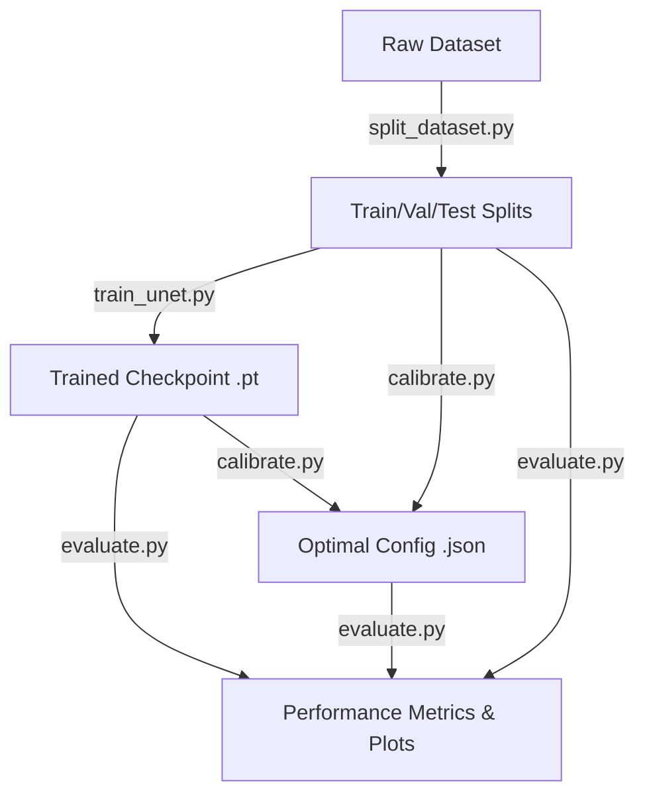

# cellmodels

[](https://www.python.org/)
[](https://opensource.org/licenses/MIT)
[](https://github.com/psf/black)
[](https://github.com/astral-sh/ruff)

Deep learning toolkit for automated estimation of **mesenchymal stem cell (MSC) confluency** from phase-contrast and brightfield microscopy images.

`cellmodels` implements a production-grade **U-Net** semantic segmentation backbone trained to generate high-fidelity pixel-level cell probability maps, coupled with an automated calibration routine to produce accurate, unbiased confluency percentage estimates.

---

## 🔬 Supported Magnifications & Performance

The library features pre-trained weights and calibrated post-processing configurations optimized for different objective magnifications:

| Magnification | Target Modality | Dataset Source | Dice Coefficient | Confluency MAE | Status |
|:---:|:---|:---|:---:|:---:|:---:|
| **10x** | Phase-contrast | [MSU-Smooth-1-20](https://www.kaggle.com/datasets/maximsolopov/msu-smooth-1-20) | **0.86** | **1.38%** | ✅ Shipped |
| **20x** | Phase-contrast | — | — | — | 🔜 Planned |
| **40x** | Phase-contrast | — | — | — | 🔜 Planned |


For a deep dive into the network architecture, preprocessing, and segmentation post-processing details, see the [Architecture Deep Dive](.docs/architecture.md).

---

## ⚙️ Installation

```bash
# Clone the repository
git clone <repository-url>
cd cellmodels

# Install the core package in editable/development mode
pip install -e .

# Install CLI script dependencies (matplotlib, tqdm)
pip install -e ".[cli]"

# Install web UI dependencies (FastAPI, uvicorn, Pillow)
pip install -e ".[web]"

# Install development tools (linting, formatting, testing)
pip install -e ".[dev]"

# (Optional) Install transfer-learning dependencies (e.g., SMP encoders)
pip install -e ".[transfer]"
```

---

## 🚀 Quick Start

### Python API

The `MSCConfluency` class handles preprocessing, U-Net forward inference, and calibrated post-processing automatically:

```python
from cellmodels import MSCConfluency

# Initialize the model (defaults to shipped 10x magnification weights)
model = MSCConfluency(magnification="10x")

# Run prediction on a 2D grayscale image (numpy array)
# Returns the raw U-Net probability map (referred to as density_map in code) and the estimated confluency percentage (0-100)
density_map, confluency_pct = model.predict(image)
print(f"Estimated MSC Confluency: {confluency_pct:.2f}%")

# [Optional] Run confluency prediction with custom parameters
density_map, confluency_pct = model.predict(
    image, 
    threshold_factor=1.0, 
    closing_radius=3, 
    min_object_size=50
)
```

### Command Line Interface (CLI)

Estimate confluency directly from the terminal. The CLI supports processing single images or entire directories, and outputs overlay images and a consolidated results CSV:

```bash
# Predict confluency for a single phase-contrast micrograph using shipped 10x model
python scripts/predict.py path/to/image.png --checkpoint cellmodels/weights/10x.pt --optimal-config cellmodels/weights/10x.json

# Predict confluency for an entire folder of micrographs, saving to a custom directory
python scripts/predict.py path/to/images/ --checkpoint cellmodels/weights/10x.pt --optimal-config cellmodels/weights/10x.json --output-dir output/predictions/

# Run inference using a custom model checkpoint and custom calibration config
python scripts/predict.py path/to/images/ --checkpoint path/to/best_model.pt --optimal-config path/to/optimal_config.json
```

### Interactive Web UI

Launch a local, interactive web dashboard to analyze confluency in a sandbox or run/monitor training runs in real-time:

```bash
# Start the web server
python scripts/ui.py --port 8000
```
Open [http://localhost:8000](http://localhost:8000) in your browser.

* **Prediction Sandbox**: Drag-and-drop cell micrographs (PNG, JPG, TIF), upload custom checkpoints, adjust threshold and morphology sliders in real-time, and view base64 overlays (with toggleable opacity) or U-Net heatmaps.
* **Model Trainer**: Configure train/val/test folders, adjust epochs/backbones, start or stop the training pipeline, stream live terminal logs, and plot validation metrics dynamically.

---


## 🛠️ Developer & Training Pipelines

`cellmodels` includes developer scripts to re-train the U-Net backbone, calibrate post-processing parameters, and evaluate model performance on independent test sets.



### 1. Dataset Preparation (Leakage-Free Splitting)
Split your raw dataset into train, validation, and test splits. Sibling tiles generated from the same parent image are grouped together to prevent spatial data leakage:
```bash
python scripts/split_dataset.py --src dataset --dst dataset --train-ratio 0.7 --val-ratio 0.15
```
*For details on the group-aware split logic, see the [Dataset Guide](.docs/dataset_guide.md).*

### 2. Model Training
Train the U-Net architecture from scratch or leverage pre-trained encoders (such as VGG16 or ResNet34) for transfer learning:
```bash
python scripts/train_unet.py \
    --train-dir dataset/train \
    --val-dir dataset/val \
    --epochs 50 \
    --batch-size 8 \
    --crop-size 512 \
    --lr 1e-4 \
    --encoder-backbone scratch
```

### 3. Post-Processing Calibration
Run grid search on validation images to search for the optimal segmentation threshold factor, closing disk radius, and minimum object size to minimize confluency estimation bias:
```bash
python scripts/calibrate.py \
    --val-dir dataset/val \
    --checkpoint output/training/best_msc_unet.pt \
    --bias-weight 0.01 \
    --output-dir output/calibration
```
*For information on the grid search and optimization score, see the [Calibration Guide](.docs/calibration_guide.md).*

### 4. Holdout Evaluation
Evaluate the calibrated model against the holdout test set to generate final verification metrics and correlation plots:
```bash
python scripts/evaluate.py \
    --test-dir dataset/test \
    --optimal-config output/calibration/optimal_config.json \
    --checkpoint output/training/best_msc_unet.pt \
    --output-dir output/evaluation
```

---

## 📁 Repository Directory Structure

```
cellmodels/
├── cellmodels/              # Core Python package
│   ├── __init__.py          # Package entry point & public API
│   ├── unet.py              # Classic U-Net architecture
│   ├── base_model.py        # Base class for pre-processing & tiled inference
│   ├── confluency.py        # MSCConfluency wrapper & segmentation
│   ├── losses.py            # Custom BCE-Dice training loss
│   ├── weights/             # Shipped checkpoints and configs
│   │   ├── 10x.pt           # 10x objective model checkpoint
│   │   └── 10x.json         # Calibrated post-processing parameters
│   └── web/                 # Interactive web UI
│       ├── server.py        # FastAPI backend
│       └── static/          # Frontend HTML/JS/CSS assets
│           ├── index.html
│           ├── app.js
│           └── styles.css
├── scripts/                 # CLI pipelines
│   ├── split_dataset.py     # Leakage-free dataset splitting
│   ├── train_unet.py        # Model training loop
│   ├── calibrate.py         # Post-processing calibration grid search
│   ├── predict.py           # Production inference runner
│   ├── evaluate.py          # Validation-qualified holdout evaluation
│   └── ui.py                # Web UI server launcher
├── tests/                   # Test suite
│   └── test_web_api.py      # Web API endpoint tests
├── .docs/                   # Extended project documentation
│   ├── README.md            # Documentation index
│   ├── architecture.md      # Architecture and mathematics deep dive
│   ├── dataset_guide.md     # Details on MSU-Smooth-1-20 and splitting
│   └── calibration_guide.md # Grid search calibration workflow details
├── pyproject.toml           # PEP 517 build system & project dependencies
└── README.md                # Root documentation index
```

---

## 📄 License

This project is licensed under the MIT License - see the [LICENSE](LICENSE) file for details.
